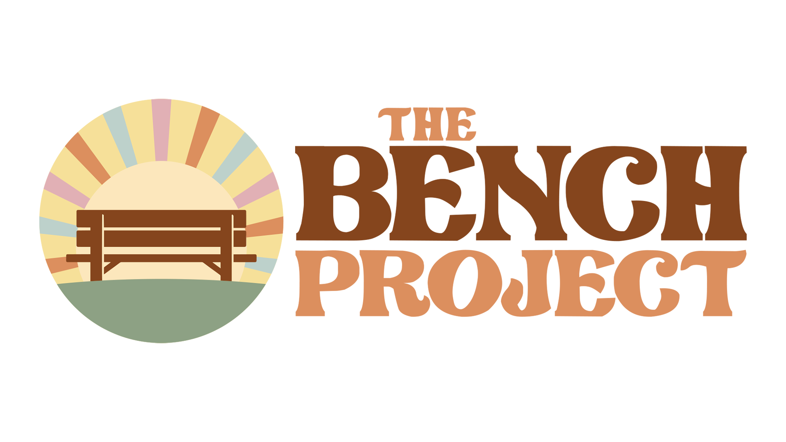

== Example Title

=== Example subtitle

----
<dependency>
    <groupId>code example</groupId>
        <artifactId>Code</artifactId>
    <version>2.4.0</version>
</dependency>

public static class myClass.....
----

Example text

* `Example 1`
** `Example 2`
*** `Example 3`

Example url: https://www.youtube.com