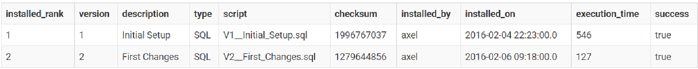
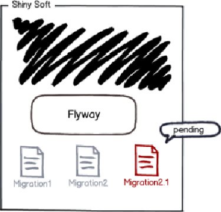
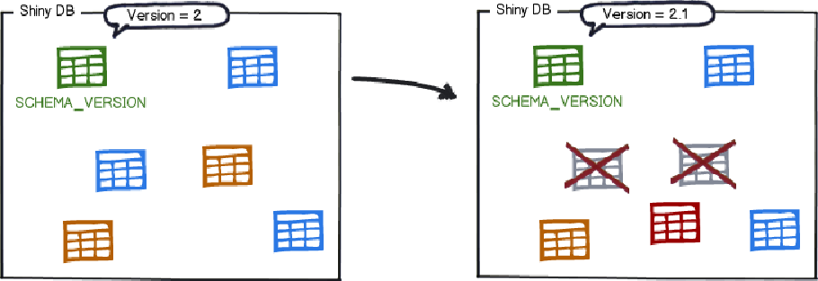
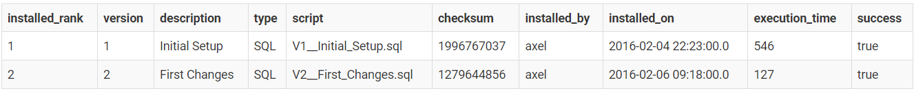
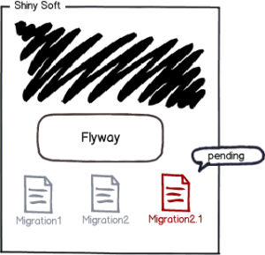
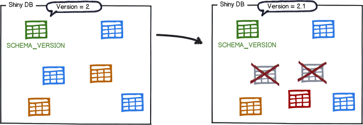
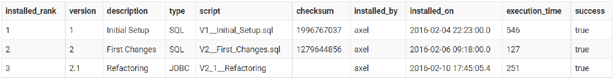

== How Flyway Works

Let's start by explaining how flyway works and
then you can start a 5 min Quickstart tutorial to try it out for yourself.

The easiest scenario is when you point Flyway to an empty database.

It will try to locate its schema history table.
As the database is empty, Flyway won't find it and will create it instead.

You now have a database with a single empty table called flyway_schema_history by default:

This table will be used to track the state of the database.

Immediately afterwards Flyway will begin scanning the filesystem or the classpath of the application for migrations. They can be written in either Sql or Java.

The migrations are then sorted based on their version number and applied in order:

As each migration gets applied, the schema history table is updated accordingly:

flyway_schema_history

With the metadata and the initial state in place, we can now talk about migrating to newer versions.

Flyway will once again scan the filesystem or the classpath of the application for migrations. The migrations are checked against the schema history table. If their version number is lower or equal to the one of the version marked as current, they are ignored.

The remaining migrations are the pending migrations: available, but not applied.

They are then sorted by version number and executed in order:

The schema history table is updated accordingly:
flyway_schema_history

And that's it!

Every time the need to evolve the database arises,
whether structure (DDL) or reference data (DML),
simply create a new migration with a version number higher than the current one.
The next time Flyway starts, it will find it and upgrade the database accordingly.