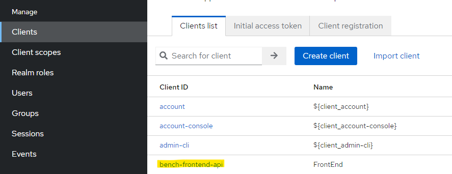
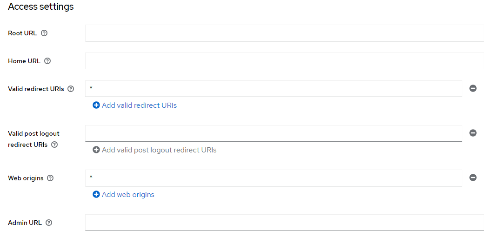
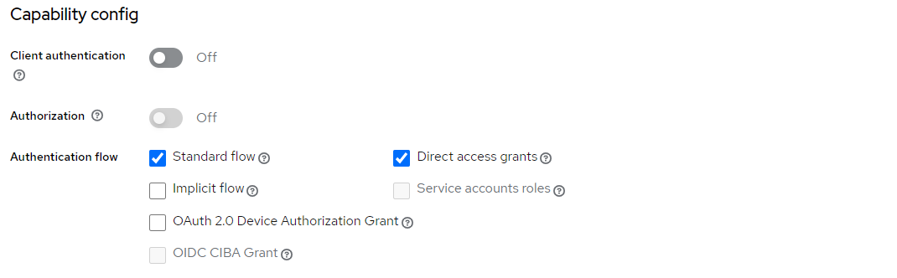
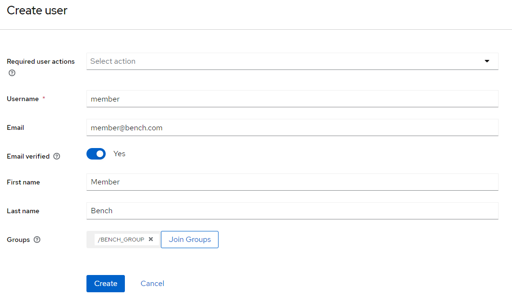
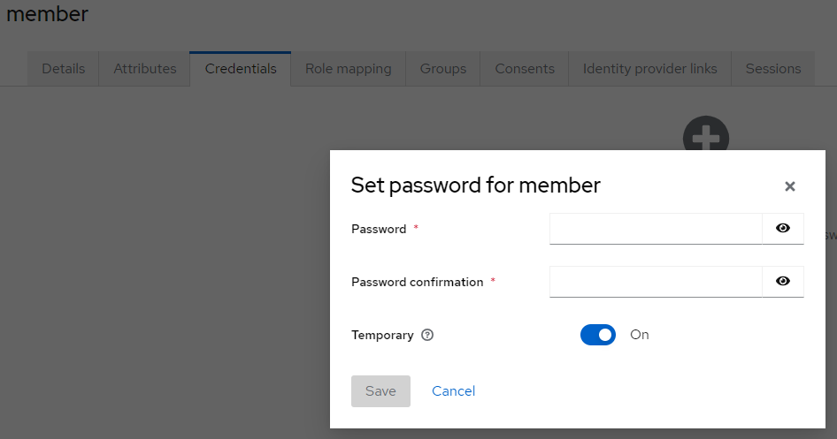
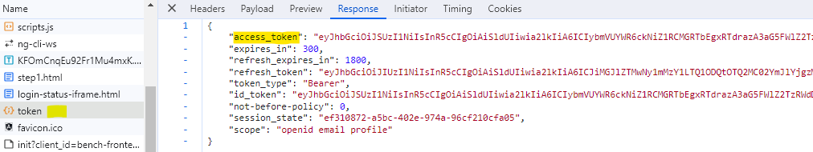
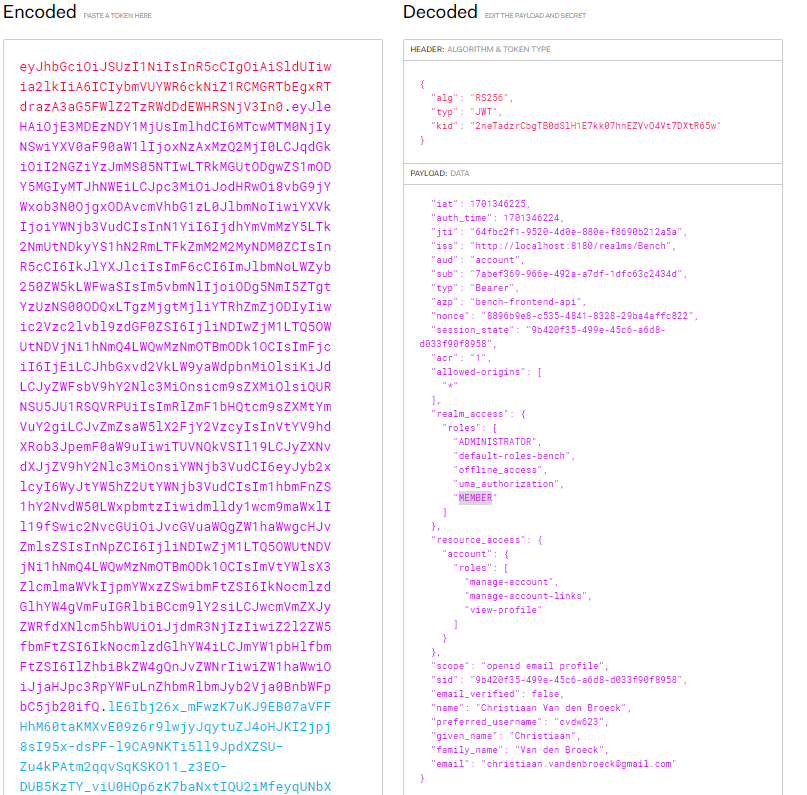

= Implement keycloak in angular

The intention is to provide a login for our `angular` application.
We chose `Keycloak` as an authentication application
that we run in a `Docker` environment together with our `postgres` database.

`Keycloak` therefore takes care of the authentication.

== Conditions:

* keycloak must be installed and running
* a working angular application

== Configuration of Keycloak

We need a new `Keycloak` client that can connect with the frontend.

`Clients` -> `Clients list` -> `Create client` -> give it the name: `bench-frontend-api`

Open the new client (click on it)

We now have to adjust a number of settings

In the section `Access settings`

* Valid redirect URIs: *
* Web origins: *

In the section `Capability config`

* Client authentication: off
* Authorization: off

=== Add a user

Of course, you need a user to log in.
You can create this via users.

Once you have created a user, you still need to set a password.
To do this, click on the user in the list and set the password.

== Angular implementation

We need the keycloak-js in or Angular project. Install it.

----
npm install keycloak-js
----

Add the following code in your `app.module.ts` file

----
import { KeycloakAngularModule, KeycloakService } from 'keycloak-angular';
...

function initializeKeycloak(keycloak: KeycloakService) {
  return () =>
    keycloak.init({
      config: {
        url: 'http://localhost:8180',
        realm: 'Bench',
        clientId: 'bench-frontend-api'
      },
      initOptions: {
        onLoad: 'login-required'
      }
    });
}
----

Add the `KeycloakAngularModule` in your `imports` section and
the `APP_INITIALIZER` to or `providers` section.

----
  imports: [
    ...
    KeycloakAngularModule
  ],
  providers: [
    {
      provide: APP_INITIALIZER,
      useFactory: initializeKeycloak,
      multi: true,
      deps: [KeycloakService]
    },...
----

== Check if we receive a JWT Token

Log in and check if there is a token in the response...

To check what is in the access token jou can use jwt.io (https://jwt.io/)
Copy the access token value and paste it in the encoded part.
The decoded part will show you wat is inside the token

